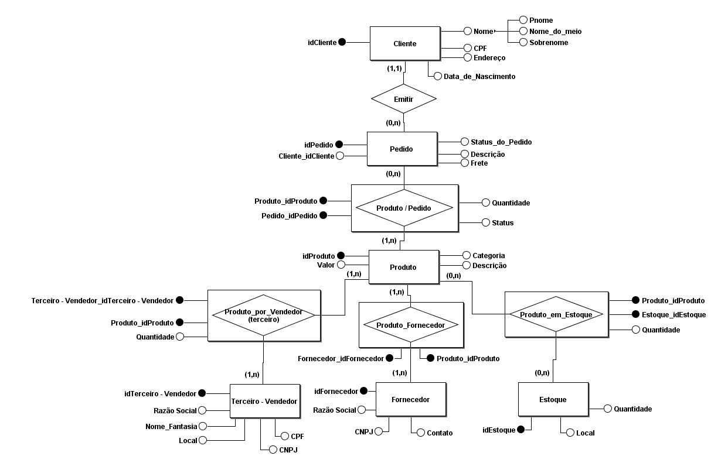
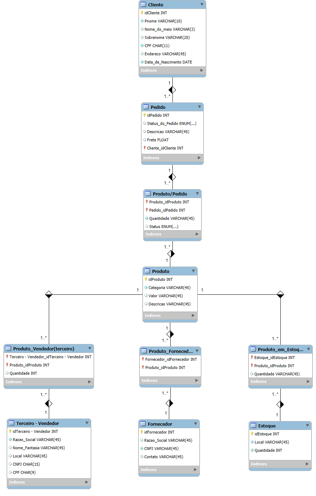

# Banco de Dados para E-commerce

Este projeto inicial visa a criação de um banco de dados para armazenamento, organização e consulta de informações conforme proposto no desafio do Bootcamp Potência Tech - iFood.

## Modelo Conceitual

  

## Modelo Lógico

  

### 🛠️ Tecnologias
As seguintes ferramentas foram utilizadas:

- [brModelo](http://www.sis4.com/brModelo/) utilizada para construção do modelo conceitual.

- [MySQL](https://www.mysql.com/) utilizada para a construção do modelo lógico, modelo físico e também para a inserção, manipulação e consulta dos dados.

### 📄 Scripts

- [Script_SQL_E-commerce](Script_SQL_E-commerce.sql) 
Este primeiro script foi elaborado para criação do modelo físico do Banco de Dados E-commerce.

- [Queries_and_data_insertion](queries_and_data_insertion.sql) 
Este segundo script foi elaborado com alguns dados que servem como base para inserção no Banco de Dados para que o usuário possa testa-lo através de consultas.

